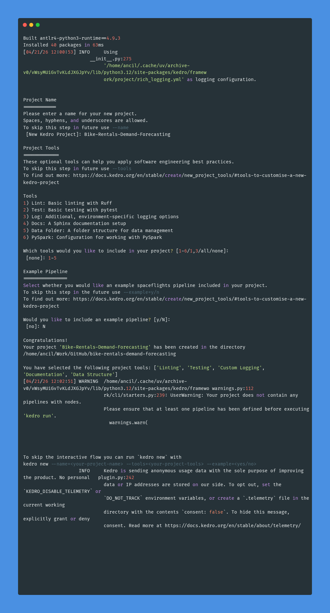
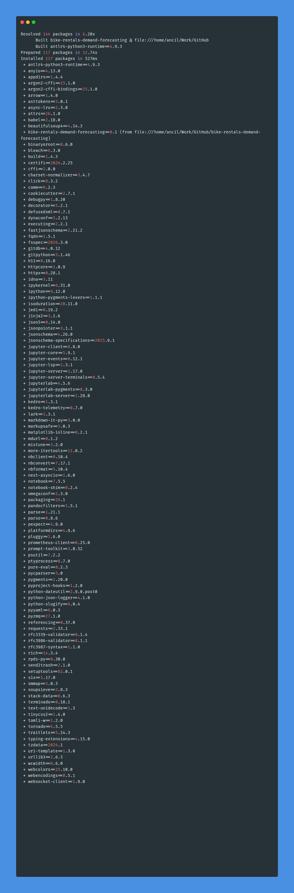

# Bike Rentals Demand Forecasting: Step-by-Step Development Log

## Installation of Libraries and Dependencies

### Create a new repo 'bike-rentals-demand-forecasting' in GitHub (with only MIT License added)

### Install Python 3.12
* `python3.12 --version`  # Python 3.12.13

### Install git
* `sudo apt update`
* `sudo apt install git`
* `git --version`  # git version 2.25.1

### Install uv => An extremely fast Python package and project manager, written in Rust
* `curl -LsSf https://astral.sh/uv/install.sh | sh`
* `uv --version`  # uv 0.11.7 (x86_64-unknown-linux-gnu)

## Create Project Structure & setup Git to commit local changes to remote GitHub repo

### Use Kedro to create project folder locally with same name as that of GitHub repo
* `cd ~/Work/GitHub`
* `uvx --python 3.12 kedro new`

### Setup local folder for commits to remote GitHub repo
* Go to local project folder created by Kedro => `cd ~/Work/GitHub/bike-rentals-demand-forecasting`
* Initialize git => `git init`
* Connect to our GitHub remote repo => `git remote add origin https://github.com/ancilcleetus/bike-rentals-demand-forecasting`
* Verify the remote was added => `git remote -v`
* Add files => `git add .`
* Initial commit => `git commit -m "Initial commit: Kedro project setup for Bike Rentals Demand Forecasting"`
* Set branch to main => `git branch -m main`
* Pull remote changes and merge => `git pull origin main --allow-unrelated-histories`
* Push to main => `git push -u origin main`

## Verify created Project Structure in VS Code, create Virtual Environment & install libraries
* Open VS Code & open folder `~/Work/GitHub/bike-rentals-demand-forecasting`
* Edit pyproject.toml => `requires-python = ">=3.10"` to `requires-python = ">=3.12,<3.13"`
* Create & activate virtual env
  * `uv venv .venv`
  * `source .venv/bin/activate`
* Install libraries => `uv sync`

## Do modeling for Bike Rentals Demand Forecasting inside notebooks/Modeling.ipynb

